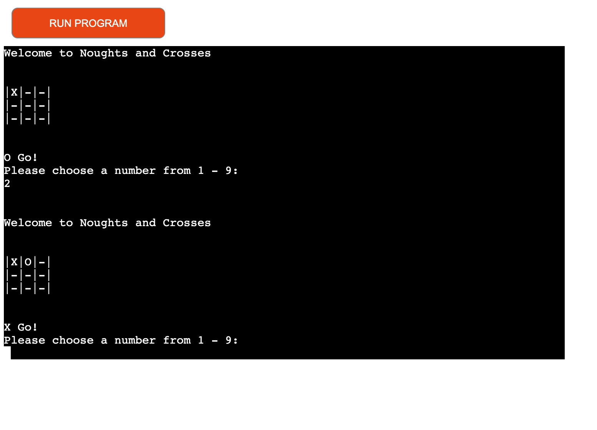

# Noughts and Crosses

Noughts and Crosses is a two player game that is played in the python terminal. It is run in the Code Institute mock terminal on Heroku.

[Here is the live version link to my project](https://noughts-and-crosses-1.herokuapp.com/)

## How to play
----------------------------------------------------

Noughts and crosses is an alternative name for the game Tic-tac-toe. You can read more about it on [Wikipedia](https://en.wikipedia.org/wiki/Tic-tac-toe)

Two players play against each other, taking turns, one is O's and the other is X's. There are nice spaces on the board and the winner must get three X's or O's in a row, column or diagonal. If either played does not get three in a row, column or diagonal the game is a draw.

## Features
-----------------------------------------------------
* Game board display
  * Welcomes players to a game of noughts and crosses.
  * Shows the board and indicates that X should go first.
  * Asks the player to choose a number between 1-9.

* X chooses a number between 1-9 and it is displayed on the board. In this case the player chose 1 and X is displayed in position 1.
* O is now told to go.

* Now O chooses a number between 1-9 and it is displayed on the board. In this case the player chose 2 and O is displayed in position 2.
* X is now told to go.

* Input validation and error checking.
  * You cannot enter the same number/position twice.
  * You can only enter numbers.

* Winner screen

* Draw screen

## Future Features
------------------------------------------------------------
* Allow player to play against computer.
* Randomly select who goes first each time, X or O.
* Keep game score.

## Testing 
--------------------------------------------------------------
* Passed code through a PEP8 linter and confirmed there are no problems.
* Ran the code through [PEP8](http://pep8online.com/) and found a number of errors which were then fixed.

* I inputted invalid numbers and words and well as same numbers and positions on board.
* Tested in my local teminal and the Code Institute Heroku terminal.

## Deployment
---------------------------------------------------------------

* Steps for deployment.
  * Create a new Heroku app called noughts-and-crosses.
  * Set a config var of key PORT value 8000.
  * Set the buildbacks to python and nodejs in that order.
  * Link the Heroku app to the respository.
  * Click on Deploy.

  ## Credits
  --------------------------------------------------------------
  * Code Institute for the lessons and deployment terminal.
  * Wikipedia for the details of the Tic-tac-toe game.

